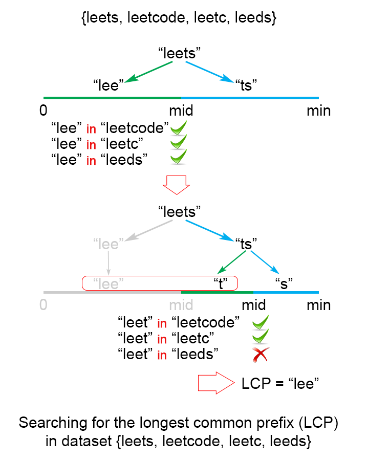
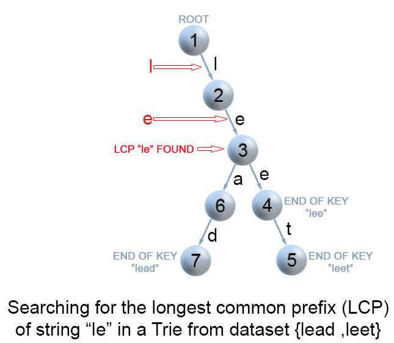

Информация взята с сайта [leetcode](https://leetcode.com/problems/longest-common-prefix/editorial/).

# Подход 1: Горизонтальное сканирование

## Рассуждение

Сначала мы опишем простой способ поиска самого длинного префикса, общего для множеств строк $LCP(S_1...S_2) = LCP(LCP(LCP(S_1,S_2),S_3),...S_n)$

## Алгоритм

Чтобы применить эту идею, алгоритм проходит через строки $[S_1...S_n]$, находя на каждой итерации $i$ самый длинный общий префикс строк $LCP(S_1...S_i)$. Когда $LCP(S_1...S_i)$ является пустой строкой, алгоритм завершает работу. В противном случае после $n$ итераций алгоритм возвращает $LCP(S_1...S_n)$.


## Выполнение

```python
class Solution:
    def longestCommonPrefix(self, strs: List[str]) -> str:
        if len(strs) == 0:
            return ""
        prefix = strs[0]
        for i in range(1, len(strs)):
            while strs[i].find(prefix) != 0:
                prefix = prefix[0 : len(prefix) - 1]
                if prefix == "":
                    return ""
        return prefix
```

## Анализ сложности

* Время сложности: $O(S)$, где $S$ — это сумма всех символов во всех строках.
* В худшем случае все $n$ строк одинаковы. Алгоритм сравнивает строку $S1$ с другими строками $[S_2...S_n]$. Здесь происходит $S$ сравнений символов, где $S$ — это сумма всех символов во входном массиве.
* Пространственная сложность: $O(1)$. Мы использовали только постоянное дополнительное пространство.

# Подход 2: Вертикальное сканирование

## Алгоритм

Представь, что очень короткая строка является общим префиксом в конце массива. Подход, описанный выше, всё равно сделает S сравнений. Один из способов оптимизации этого случая — использовать вертикальное сканирование. Мы сравниваем символы сверху вниз в одном столбце (один и тот же индекс символов строк), прежде чем переходить к следующему столбцу.

## Выполнение

```python
class Solution:
    def longestCommonPrefix(self, strs: List[str]) -> str:
        if strs == None or len(strs) == 0:
            return ""
        for i in range(len(strs[0])):
            c = strs[0][i]
            for j in range(1, len(strs)):
                if i == len(strs[j]) or strs[j][i] != c:
                    return strs[0][0:i]
        return strs[0]
```

## Анализ сложности

* Время сложности: $O(S)$, где $S$ — это сумма всех символов во всех строках.
В худшем случае будут $n$ равных строк длиной $m$, и алгоритм выполняет $S = m ⋅ n$ сравнений символов.
Несмотря на то, что худший случай такой же, как в [подходе 1](#подход-1-горизонтальное-сканирование), в лучшем случае выполняется не более $n ⋅ minLen$ сравнений, где $minLen$ — длина самой короткой строки в массиве.
* Пространственная сложность: O(1). Мы использовали только постоянное дополнительное пространство.

# Подход 3: Разделяй и властвуй

## Рассуждение

Идея алгоритма основана на ассоциативном свойстве операции LCP. Мы замечаем, что:
$LCP(S_1...S_n) = LCP(LCP(S_1...S_k), LCP(S_{k+1}...S_n))$, где $LCP(S_1...S_n)$ — это самый длинный общий префикс в наборе строк $[S_1...S_n]$, $1 < k < n$.

## Алгоритм

Чтобы применить вышеуказанное наблюдение, мы используем технику разделения и завоевания, где мы делим проблему $LCP(S_i...S_j)$ на две подпроблемы: $LCP(S_i...S_{mid})$ и $LCP(S_{mid+1}...S_j)$, где $mid$ равно $\frac{i+j}{2}$. Мы используем их решения $lcpLeft$ и $lcpRight$ для построения решения основной проблемы $LCP(S_i...S_j)$. Чтобы достичь этого, мы сравниваем посимвольно $lcpLeft$ и $lcpRight$ до тех пор, пока не найдем совпадение символов. Найденный общий префикс $lcpLeft$ и $lcpRight$ является решением для $LCP(S_i...S_j)$.


*Рисунок 2. Нахождение самого длинного общего префикса строк с использованием метода разделения и завоевания*

## Выполнение

```python
class Solution:
    def longestCommonPrefix(self, strs):
        if not strs:
            return ""

        def LCP(left, right):
            min_len = min(len(left), len(right))
            for i in range(min_len):
                if left[i] != right[i]:
                    return left[:i]
            return left[:min_len]

        def divide_and_conquer(strs, l, r):
            if l == r:
                return strs[l]
            else:
                mid = (l + r) // 2
                lcpLeft = divide_and_conquer(strs, l, mid)
                lcpRight = divide_and_conquer(strs, mid + 1, r)
                return LCP(lcpLeft, lcpRight)

        return divide_and_conquer(strs, 0, len(strs) - 1)
```

## Анализ сложности

В худшем случае у нас есть n одинаковых строк длиной m

* Время сложности: $O(S)$, где $S$ — это количество всех символов в массиве, $S = m ⋅ n$
Время сложности составляет $2 ⋅ T(\frac{n}{2}) + O(m)$. Следовательно, время сложности — $O(S)$.
В лучшем случае этот алгоритм выполняет $O(minLen ⋅ n)$ сравнений, где $minLen$ — минимальная длина строки в массиве
* Пространственная сложность: $O(m ⋅ log n)$
Здесь присутствует дополнительная нагрузка на память, так как мы храним рекурсивные вызовы в стеке выполнения. Существует $log n$ рекурсивных вызовов, каждый из которых требует $m$ пространства для хранения результата, поэтому пространственная сложность составляет $O(m ⋅ log n)$.

# Подход 4: Бинарный поиск

## Рассуждение

Идея заключается в применении метода бинарного поиска для нахождения строки с максимальным значением $L$, которая является общим префиксом для всех строк. Алгоритм осуществляет поиск в интервале $(0…minLen)$, где $minLen$ — минимальная длина строки и максимально возможный общий префикс. Каждый раз пространство поиска делится на две равные части, одна из которых отбрасывается, так как точно известно, что она не содержит искомого решения. Возможны два варианта:

* $S[1...mid]$ не является общей строкой. Это означает, что для любого $j > i S[1..j]$ тоже не является общей строкой, и мы отбрасываем вторую половину пространства поиска.
* $S[1...mid]$ является общей строкой. Это означает, что для любого $i < j S[1..i]$ является общей строкой, и мы отбрасываем первую половину пространства поиска, так как пытаемся найти более длинный общий префикс.


*Рисунок 3. Нахождение самого длинного общего префикса строк с использованием техники бинарного поиска*

## Вычисление

```python
class Solution:
    def longestCommonPrefix(self, strs: List[str]) -> str:
        if not strs:
            return ""
        minLen = min(len(x) for x in strs)
        low, high = 1, minLen
        while low <= high:
            middle = (low + high) // 2
            if self.isCommonPrefix(strs, middle):
                low = middle + 1
            else:
                high = middle - 1
        return strs[0][: (low + high) // 2]

    def isCommonPrefix(self, strs, l):
        str1 = strs[0][:l]
        for i in range(1, len(strs)):
            if not strs[i].startswith(str1):
                return False
        return True
```

## Анализ сложности

В худшем случае у нас есть $n$ одинаковых строк длиной $m$

* Время сложности: $O(S ⋅ log m)$, где $S$ — это сумма всех символов во всех строках.
Алгоритм выполняет $log m$ итераций, для каждой из которых требуется $S = m ⋅ n$ сравнений, что в итоге даёт временную сложность $O(S ⋅ log m)$.
* Пространственная сложность: $O(1)$. Мы использовали только постоянное дополнительное пространство.

# Дальнейшие мысли

> Давайте рассмотрим немного другую задачу:
Для заданного набора ключей $S = [S_1, S_2, ..., S_n]$ найдите самый длинный общий префикс между строкой $q$ и набором $S$. Этот запрос $LCP$ будет выполняться часто.

Мы могли бы оптимизировать запросы LCP, сохраняя набор ключей S в структуре Trie (граф). Дополнительную информацию о Trie можно найти в статье "[Реализовать Trie (Префиксное дерево)](../208_implement_trie/README.md)". В Trie каждый узел, следующий от корня, представляет собой общий префикс некоторых ключей. Однако нам нужно найти самый длинный общий префикс строки $q$ и всех ключевых строк. Это означает, что нам нужно найти самый глубокий путь от корня, удовлетворяющий следующим условиям:

* это префикс строки-запроса $q$;
* каждый узел вдоль пути должен содержать только один дочерний элемент. В противном случае найденный путь не будет общим префиксом среди всех строк;
* путь не включает узлы, помеченные как конец ключа. В противном случае путь не мог бы быть префиксом ключа, который короче самого себя.

## Алгоритм

Единственный оставшийся вопрос — как найти самый глубокий путь в Trie, который удовлетворяет вышеперечисленным требованиям. Наиболее эффективный способ — построить Trie из строк $[S_1 ... S_n]$. Затем найти префикс строки-запроса $q$ в Trie. Мы перемещаемся по Trie от корня до тех пор, пока невозможно продолжить путь в Trie, потому что одно из условий выше не выполнено.


*Рисунок 4. Поиск самого длинного общего префикса строк с использованием Trie*

## Вычисление

```python
class TrieNode:
    def __init__(self):
        self.children = {}
        self.isEnd = False
        self.linkCount = 0

    def addChild(self, char):
        if char not in self.children:
            self.children[char] = TrieNode()
            self.linkCount += 1


class Trie:
    def __init__(self):
        self.root = TrieNode()

    def insert(self, word):
        node = self.root
        for char in word:
            if char not in node.children:
                node.addChild(char)
            node = node.children[char]
        node.isEnd = True

    def searchLongestPrefix(self, word):
        node = self.root
        chars = []
        for char in word:
            if char in node.children and node.linkCount == 1 and not node.isEnd:
                chars.append(char)
                node = node.children[char]
            else:
                break
        return "".join(chars)


class Solution:
    def longestCommonPrefix(self, q, strs):
        if not strs:
            return ""
        if len(strs) == 1:
            return strs[0]
        trie = Trie()
        for s in strs[1:]:
            trie.insert(s)
        return trie.searchLongestPrefix(q)
```

## Анализ сложности

В худшем случае запрос $q$ имеет длину $m$ и равен всем $n$ строкам массива.
* Время сложности: предобработка $O(S)$, где $S$ — количество всех символов в массиве, запрос LCP $O(m)$.
Создание Trie имеет временную сложность $O(S)$. Поиск общего префикса $q$ в Trie в худшем случае занимает $O(m)$.
* Пространственная сложность: $O(S)$. Мы использовали только дополнительное пространство $S$ для Trie.